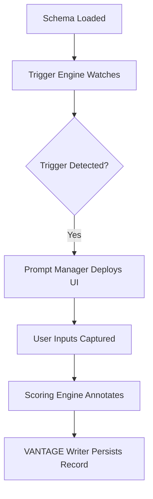

# AnthroSynth – Technical Architecture Document
*Version: 0.1 | Date: 2025-07-01*

---

## 🔹 1. Overview
AnthroSynth is a schema-driven behavioural intelligence runtime engine designed to ingest plug-in modules, orchestrate behavioural data collection in high-stakes environments, and write that data into the VANTAGE dataset. The engine is agnostic to domain and modular in architecture.

---

## 🔹 2. Core Components

| Component                   | Description                                                              |
|-----------------------------|--------------------------------------------------------------------------|
| `AnthroSynth Runtime`       | Main orchestrator that interprets and executes plug-in schemas.          |
| `Schema Loader`             | Module that loads JSON/YAML/TOML schemas and validates structure.        |
| `Trigger Engine`            | Detects context-defined triggers to initiate behavioural capture.        |
| `Prompt Manager`            | Renders questions, sliders, text boxes, etc., via UI hooks or console.   |
| `Event Recorder`            | Collects and annotates input from users (active + passive).              |
| `Scoring Engine`            | Applies confidence/weighting/scoring models defined in schema.           |
| `VANTAGE Writer`            | Formats and writes outputs to the VANTAGE dataset format.                |

---

## 🔹 3. Plug-in Schema Interface

Each plug-in schema must implement the following structure:

```json
{
  "module_id": "mifidpru-risk-001",
  "triggers": [
    { "type": "UI", "selector": "#submitRisk", "event": "click" }
  ],
  "prompts": [
    {
      "id": "risk_confidence",
      "type": "slider",
      "range": [0, 10],
      "label": "How confident are you in this risk mitigation?"
    }
  ],
  "tags": ["emotional", "financial", "compliance"],
  "contextVars": ["user_role", "firm_type", "decision_stage"],
  "scoring": {
    "model": "weighted-average",
    "weights": { "confidence": 0.7, "timing": 0.3 }
  }
}
```

---

## 🔹 4. Runtime Orchestration Flow



---

## 🔹 5. Event Lifecycle

1. **Trigger Phase** – Schema-defined condition is met (e.g. form submit, timer, threshold crossed).
2. **Capture Phase** – Prompts/questions/sliders deployed via interface.
3. **Input Phase** – User enters data actively or passive tracking occurs.
4. **Annotation Phase** – Metadata, confidence scores, timing logged.
5. **Write Phase** – Formatted record pushed into persistent VANTAGE dataset.

---

## 🔹 6. Data Capture Pipeline

| Layer        | Functions                                                          |
|--------------|---------------------------------------------------------------------|
| `Prompt UI`  | Renders micro-feedback elements (sliders, dropdowns, justifications). |
| `Passive Loggers` | Captures timing, navigation patterns, decision latency.         |
| `Context Hooks` | Reads app state, user type, active module from host system.       |

---

## 🔹 7. VANTAGE Dataset Format (Draft)

Each entry is a time-stamped, versioned object:

```json
{
  "timestamp": "2025-07-01T14:33:22Z",
  "module": "mifidpru-kfactor",
  "user_id": "anon-8743",
  "context": {
    "firm_type": "non-SNI",
    "decision_stage": "post-mitigation"
  },
  "inputs": {
    "slider_confidence": 7,
    "text_justification": "Mitigation is well embedded and routinely tested."
  },
  "tags": ["risk", "confidence", "financial"],
  "score": 6.9,
  "schema_version": "v1.0"
}
```

---

## 🔹 8. Security & Privacy

- **Anonymisation**: User IDs are hashed or tokenised.
- **Encryption**: All write operations encrypted at rest and in transit.
- **Schema-based Redaction**: Sensitive fields can be flagged for omission.
- **Granular Consent Models**: Users can opt into specific tracking categories.

---

## 🔹 9. Extensibility

- `Plugin Interface`: New domains can be integrated via JSON/YAML schemas.
- `Runtime Hooks`: Developers can define lifecycle callbacks (preTrigger, postWrite).
- `Custom Renderers`: SDK allows override of prompt UI for domain-specific design.

---

## 🔹 10. Deployment Models

| Model          | Description                                   |
|----------------|-----------------------------------------------|
| Embedded SDK   | Injected into web apps or SaaS platforms      |
| Standalone API | Remote behavioural tracking via secure calls  |
| On-Prem Runtime| For regulated sectors requiring full control  |

---

## 📦 Roadmap
- `v0.1`: Core runtime + MiFIDPRU prototype
- `v0.2`: SDK + Plug-in validator
- `v0.3`: Visual schema builder + VANTAGE analytics frontend

