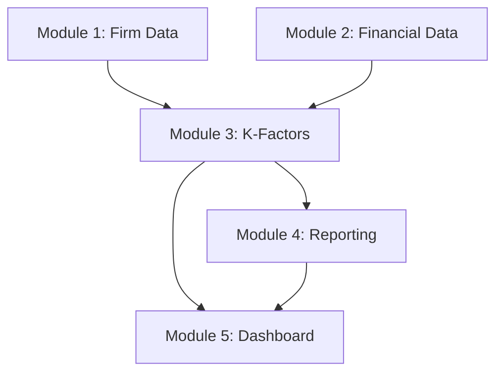

# 📦 PRISM Modules Overview

> *Modular architecture for regulatory compliance calculations*

---

## Module Structure

### ✅ Module 1: Firm Data Management
**Status**: Complete | **Coverage**: 95%

#### Components
- Company registration details
- Regulatory permissions
- Ownership structure
- Key personnel records

#### Key Files
- [[GOLDEN-SOURCE/02-DOCUMENTATION/session-history/session wraps/module-1-firm-data-session-wrap-20250714|Session Wrap]]
- Data models: `firm_data.ts`
- API endpoints: `/api/firm/*`

---

### ✅ Module 2: Financial Data Processing
**Status**: Complete | **Coverage**: 92%

#### Components
- Transaction processing
- Balance sheet integration
- P&L calculations
- Cash flow analysis

#### Key Files
- [[GOLDEN-SOURCE/02-DOCUMENTATION/session-history/session wraps/module-2-financial-data-session-wrap-20250714|Session Wrap]]
- Processing engine: `financial_processor.ts`
- Validation rules: `financial_validators.ts`

---

### 🟡 Module 3: K-Factor Calculators
**Status**: In Progress | **Coverage**: 78%

#### Completed Calculators
- ✅ K-AUM (Assets Under Management)
- ✅ K-CMH (Client Money Held)
- ✅ K-ASA (Assets Safeguarded)
- ✅ K-DTF (Daily Trading Flow)
- 🟡 K-COH (Client Orders Handled) - Testing

#### In Development
- 🔵 K-NPR (Net Position Risk)
- 🔵 K-CMG (Clearing Margin Given)
- 🔵 K-TCD (Trading Counterparty Default)

#### Documentation
- [[K-Factor-Index|Complete K-Factor Documentation]]
- [[GOLDEN-SOURCE/02-DOCUMENTATION/session-history/session wraps/module-3-for-calculator-session-wrap-20250714|Session Wrap 1]]
- [[GOLDEN-SOURCE/02-DOCUMENTATION/session-history/session wraps/module-3-for-calculator-session-wrap-20250715|Session Wrap 2]]

---

### 🔵 Module 4: Reporting Engine
**Status**: Planning | **Coverage**: 0%

#### Planned Features
- Automated FCA report generation
- XBRL format support
- Historical trend analysis
- Alert notifications

#### Dependencies
- Requires Modules 1-3 complete
- External API integrations
- Report template system

---

### 🔵 Module 5: Compliance Dashboard
**Status**: Design | **Coverage**: 0%

#### Planned Components
- Real-time monitoring
- Breach detection
- Threshold tracking
- Audit trail viewer

#### Technical Stack
- Frontend: React/Next.js
- Charts: Recharts
- State: Redux/Context API
- Real-time: WebSockets

---

## 🔄 Module Dependencies



---

## 📊 Integration Points

### Data Flow
1. **Input**: Raw data from various sources
2. **Processing**: Module-specific transformations
3. **Calculation**: K-Factor computations
4. **Aggregation**: Combined metrics
5. **Output**: Reports and dashboards

### API Structure
```
/api/v1/
├── /firm/          # Module 1
├── /financial/     # Module 2
├── /kfactors/      # Module 3
├── /reports/       # Module 4
└── /dashboard/     # Module 5
```

---

## 🧪 Testing Strategy

### Coverage Goals
- Unit Tests: 90%
- Integration Tests: 85%
- E2E Tests: 75%

### Test Categories
1. **Data Validation** - Input sanitization
2. **Calculation Accuracy** - Formula correctness
3. **Performance** - Load testing
4. **Security** - Penetration testing
5. **Compliance** - Regulatory requirements

---

## 📈 Performance Metrics

| Module | Load Time | Memory | API Response |
|--------|-----------|---------|--------------|
| Firm Data | 250ms | 50MB | < 200ms |
| Financial | 400ms | 120MB | < 300ms |
| K-Factors | 150ms | 80MB | < 150ms |
| Reporting | TBD | TBD | TBD |
| Dashboard | TBD | TBD | TBD |

---

## 🚀 Deployment Status

### Environments
- **Production**: Modules 1-2 ✅
- **Staging**: Modules 1-3 🟡
- **Development**: All modules 🟢

### CI/CD Pipeline
- Automated testing on push
- Staging deployment on merge
- Manual production release

---

## 📝 Documentation Links

### Architecture
- [[System Architecture Overview]]
- [[Database Schema]]
- [[API Documentation]]

### Development
- [[Development Guidelines]]
- [[Code Standards]]
- [[Git Workflow]]

### Operations
- [[Deployment Guide]]
- [[Monitoring Setup]]
- [[Backup Procedures]]

---

## 🏷️ Module Tags

- `#prism/module-1` - Firm data
- `#prism/module-2` - Financial data
- `#prism/module-3` - K-Factors
- `#prism/module-4` - Reporting
- `#prism/module-5` - Dashboard

---

*Overview updated: {{date}}*
[[PRISM-Hub]] | [[K-Factor-Index]] | [[Home]]