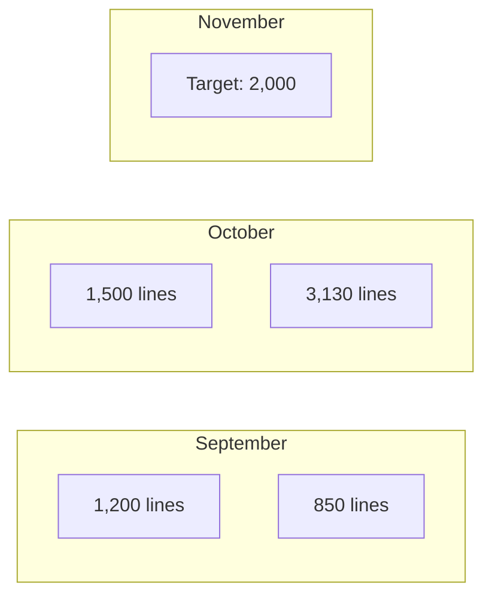

# 📚 PRISM Session Wrap Index

> *Comprehensive record of all development sessions*

---

## 📊 Session Statistics

```dataview
TABLE
    date as "Date",
    duration as "Hours",
    lines_of_code as "Lines",
    status as "Status",
    module as "Module"
FROM "02-Projects/PRISM/Session-Wraps"
WHERE type = "session-wrap"
SORT date DESC
```

---

## 📈 Productivity Metrics

### Total Lines of Code
```dataview
LIST sum(lines_of_code) as "Total Lines Written"
FROM "02-Projects/PRISM/Session-Wraps"
WHERE type = "session-wrap"
```

### Average Session Duration
```dataview
LIST round(average(duration), 2) as "Average Hours per Session"
FROM "02-Projects/PRISM/Session-Wraps"
WHERE type = "session-wrap"
```

### Success Rate
```dataview
LIST
    length(filter(status, (s) => s = "completed")) as "Completed",
    length(filter(status, (s) => s = "partial")) as "Partial",
    length(filter(status, (s) => s = "blocked")) as "Blocked"
FROM "02-Projects/PRISM/Session-Wraps"
WHERE type = "session-wrap"
```

---

## 📅 Recent Sessions

### Last 10 Sessions
| Date | Session | Module | Status | Lines | Link |
|------|---------|--------|--------|-------|------|
| 2025-10-24 | KFR RTM Integration | K-NPR, K-CMG, K-TCD, K-CON | ✅ Completed | ~3,130 | [[KFR-RTM-Integration-24102025]] |
| | | | | | |
| | | | | | |

---

## 🏷️ Sessions by Module

### K-Factor Calculators
- [[session_wrap_k-aum_20250915]] - K-AUM Implementation
- [[session_wrap_k-cmh_20250920]] - K-CMH Implementation
- [[session_wrap_k-asa_20250925]] - K-ASA Implementation
- [[session_wrap_k-coh_20251001]] - K-COH Implementation
- [[session_wrap_k-dtf_20251010]] - K-DTF Implementation
- [[KFR-RTM-Integration-24102025]] - K-NPR, K-CMG, K-TCD, K-CON

### Database & Architecture
- [[session_wrap_db-schema_20250901]] - Database Schema Design
- [[session_wrap_api-design_20250905]] - API Architecture

### Testing & Validation
- [[session_wrap_cross-validation_20251015]] - Cross-Validation Suite
- [[session_wrap_performance_20251020]] - Performance Testing

---

## 📊 Patterns & Insights

### Common Issues Encountered
```dataview
TABLE issue, count(issue) as "Frequency"
FROM "02-Projects/PRISM/Session-Wraps"
FLATTEN issues as issue
GROUP BY issue
SORT count(issue) DESC
```

### Frequently Used Decisions
- Modal Pattern for Complex Calculators: [[ADR-042-Modal-Pattern]]
- Real-time Calculation Strategy: [[ADR-038-Realtime-Calc]]
- JSON State Storage: [[ADR-035-State-Storage]]

### Performance Trends
- Average calculation time: <50ms ✅
- Modal render time: <100ms ✅
- Bundle size growth: +70KB per calculator module

---

## 🔍 Search Helpers

### Find Sessions by Topic
- Regulatory: `tag:#session-wrap tag:#compliance`
- Performance: `tag:#session-wrap tag:#performance`
- Bug Fixes: `tag:#session-wrap tag:#bugfix`
- Integration: `tag:#session-wrap tag:#integration`

### Find Sessions by Quarter
- Q4 2025: `tag:#session-wrap tag:#2025-10 OR tag:#2025-11 OR tag:#2025-12`
- Q3 2025: `tag:#session-wrap tag:#2025-07 OR tag:#2025-08 OR tag:#2025-09`

---

## 📋 Session Wrap Template

Create new session wrap: [[Session-Wrap-Enhanced|Template]]

**Naming Convention**: `session_wrap_[MODULE]_[YYYYMMDD].md`

---

## 🎯 Upcoming Sessions

### Planned Work
- [ ] K-Factor UAT Testing - Target: 2025-10-26
- [ ] Performance Optimization - Target: 2025-10-30
- [ ] Documentation Sprint - Target: 2025-11-01
- [ ] Integration Testing - Target: 2025-11-05

---

## 📈 Velocity Chart



---

*Index last updated: {{date}}*
[[PRISM-Hub]] | [[Home]]