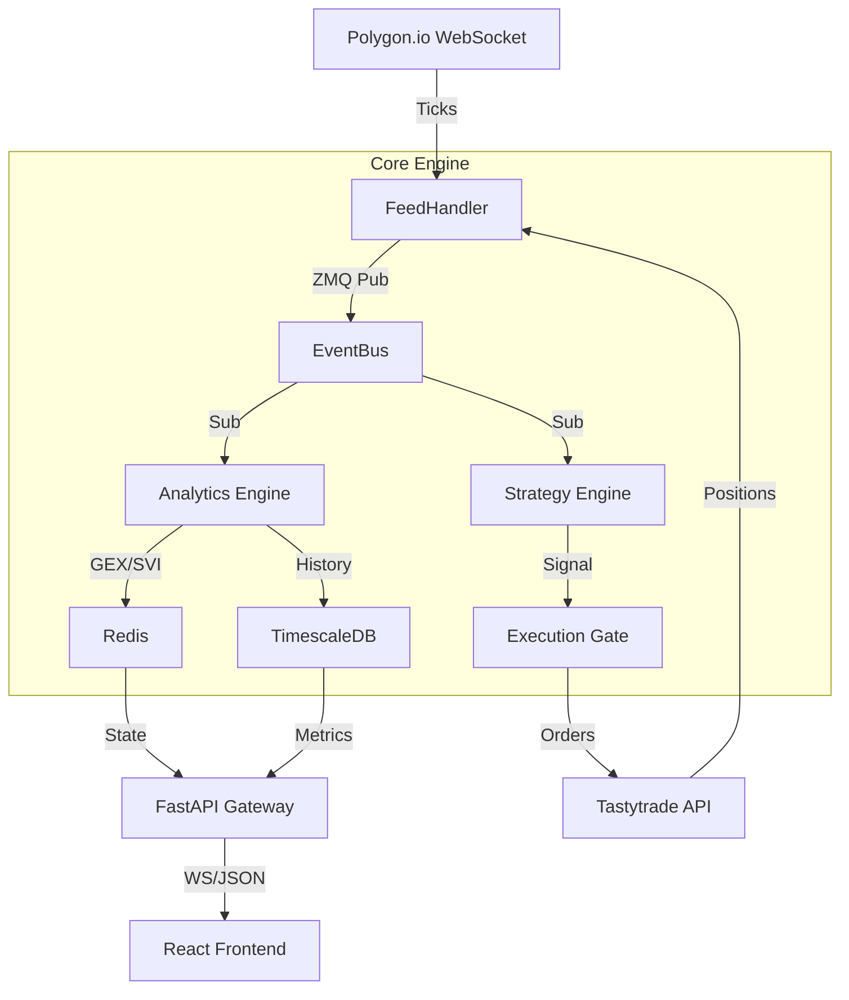

 p# Project Manifold: Systematic Volatility Arbitrage Engine

## 1. Executive Summary
**Project Manifold** is an institutional-grade quantitative trading engine designed to identify and exploit structural inefficiencies in the options volatility surface. Unlike retail dashboards that focus on "selling high IV," Manifold analyzes the **topology** of the volatility surface (Strike vs. Expiry vs. IV) to identify arbitrage opportunities, regime shifts, and gamma exposure imbalances.

**Core Philosophy:**
1.  **Surface Arbitrage:** The volatility surface is a manifold. Structural defects (kinks, deviations from SVI parametrization) represent mispriced risk.
2.  **Regime Dependence:** All strategies are conditional on the Market Regime (Calm, Trending, Stress), identified via Hidden Markov Models (HMM).
3.  **Flow-Driven Risk:** Market Maker Gamma Exposure (GEX) dictates short-term price stability. We never sell volatility when the market is "short gamma."

---

## 2. Architecture: The "HFT-Lite" Engine

### 2.1 Tech Stack
*   **Language:** Python 3.11+ (Async/Await, Type Hints)
*   **Messaging:** ZeroMQ (ZMQ) - Event-driven architecture
*   **Database:**
    *   **TimescaleDB:** Time-series storage (IV history, 1-min candles)
    *   **Redis:** Hot state (Live positions, real-time Greeks)
*   **Math Kernel:** `scipy.optimize` (SVI calibration), `numba` (JIT compilation), `hmmlearn` (Regime detection)
*   **Frontend:** React 18, TypeScript, `react-three-fiber` (3D Surface Viz)

### 2.2 System Diagram


---

## 3. Module Specifications

### 3.1 Core (`manifold.core`)
The nervous system. Handles messaging and state persistence.
*   **`messaging.py`**: ZeroMQ Publisher/Subscriber wrappers.
*   **`database.py`**: Connection pools for TimescaleDB (asyncpg) and Redis.

### 3.2 Feed (`manifold.feed`)
Ingests raw market data.
*   **`massive.py`**: Connects to Polygon.io WebSocket. Normalizes option trade/quote messages into internal `Tick` objects.
*   **`geeks.py`**: Real-time Greek calculator. Uses `numba` for JIT-compiled Black-Scholes-Merton.

### 3.3 Analytics (`manifold.analytics`)
The heavy math layer.
*   **`surface.py`**: **Stochastic Volatility Inspired (SVI)** parametrization. Fits the raw option chain to the SVI curve to find "kinks" (mispricings).
*   **`gex.py`**: Calculates the Net Gamma Exposure profile of the entire SPX/SPY complex to determine market stability.
*   **`regime.py`**: Runs the Hidden Markov Model (HMM) on VIX/SPX returns to classify the current state (Low Vol, High Vol, Crisis).

### 3.4 Strategy (`manifold.strategy`)
The decision maker.
*   **`alpha/surface_arb.py`**: Scans for strikes that deviate > 1.5 sigma from the SVI curve.
*   **`alpha/earnings_ml.py`**: Uses XGBoost to predict earnings moves vs. implied moves.
*   **`alpha/tail_risk.py`**: Monitors "Crash Risk" via VIX Term Structure Backwardation.

### 3.5 Execution (`manifold.execution`)
The trigger finger.
*   **`risk_gate.py`**: Checks Portfolio Beta-Weighting and Correlation before allowing an order.
*   **`smart_order.py`**: Algorithmic execution. "Legs in" to spreads by waiting for micro-structure signals (RSI/Order Flow).

---

## 4. Data Models

### 4.1 Volatility Surface
We don't just store IV. We store the **SVI Parameters** ($a, b, \rho, m, \sigma$) for every expiry, every minute.
```python
@dataclass
class SVISurface:
    symbol: str
    timestamp: float
    slices: List[SVISlice] # One slice per expiry

@dataclass
class SVISlice:
    expiry: date
    params: Dict[str, float] # a, b, rho, m, sigma
    rmse: float # Fit quality
```

### 4.2 Market Regime
```python
class MarketRegime(Enum):
    CALM_BULL = 1   # Low Vol, Positive Trend, GEX > 0
    VOLATILE_BULL = 2 # High Vol, Positive Trend
    CORRECTION = 3  # High Vol, Negative Trend, GEX < 0
    CRASH = 4       # Extreme Vol, Backwardation
```
