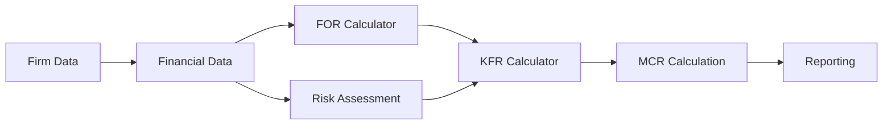

# CLAUDE.md - MCP-Powered Living Context
## Project PRISM: AI-Assisted MiFIDPRU Regulatory Platform
### Oracle Environment Edition with Persistent Memory

> This document is automatically loaded by MCP on every session.
> It evolves as you work - patterns update, modules track, context persists.

---

## 🧠 MCP CONTEXT INTEGRATION

```yaml
Status: ACTIVE ✅
Server: ~/.config/claude/mcp-servers/prism-core/
Context DB: /srv/prism-shared/.mcp-context/db/context.json
Auto-Loaded: YES - Every CC session
Session Persistence: ENABLED
Last Sync: September 16, 2025
```

### How This Document Works Now
1. **MCP reads this** automatically when you type `cc`
2. **Patterns enforced** without reminders needed
3. **Progress tracked** as you work
4. **Context preserved** between all sessions
5. **Updates flow back** to keep this current

---

## 🏗️ PROJECT IDENTITY

```yaml
Project: PRISM (Prudential Risk Intelligence & Solvency Management)
Type: MiFIDPRU/ICARA Regulatory Compliance Platform
Client: UK Investment Firms
Stack: Next.js 14 + TypeScript + React
Status: 70% Complete (10 modules done, 4 in progress)
Context: 20+ years City of London financial services expertise
```

### Commercial Impact
- **Time Savings**: 90% reduction in ICARA process time
- **Cost Savings**: £100,000+ annually per firm
- **Accuracy**: 100% regulatory compliance, penny-perfect
- **Innovation**: First platform with Monte Carlo risk assessment

---

## 🌍 ORACLE ENVIRONMENT ARCHITECTURE

```
Your Development Universe:
├── 📦 PRISM-PRODUCTION/           [prism-prod]
│   └── project-prism/             # Safe, stable, careful work
│       ├── src/modules/           # Your TypeScript modules
│       └── Branch: adrian         # Your main branch
│
├── 🧪 PRISM-SANDBOX/              [prism-sandbox]
│   └── project-prism-sandbox/     # Break anything! Experiment!
│       └── Branch: sandbox/*      # Wild experiments
│
├── 🔧 PRISM-FEATURES/             [prism-features]
│   └── feature-*/                 # Isolated feature development
│
└── 📚 /srv/prism-shared/          [prism-shared]
    ├── GOLDEN-SOURCE/             # Truth (syncs Mac ↔ Linux)
    │   ├── 01-PROTOTYPES/         # 16 HTML calculators
    │   └── 02-DOCUMENTATION/      # All docs including THIS
    └── .mcp-context/              # MCP MEMORY
```

---

## 👤 CONTEXT: WHO YOU ARE (MCP Remembers)

```javascript
const YOU = {
  // Identity
  name: "Adrian",
  role: "Solo Founder + FCA-regulated firm owner",
  experience: "20+ years City of London",
  background: "FSA → Investment Advisory → RegTech Founder",
  
  // Working Style (MCP Enforces)
  preferences: {
    spelling: "british",        // colour, optimise, analyse
    emojis: false,             // Professional only
    style: "direct",           // No fluff
    humour: "dry wit ok",      // Intelligent sarcasm acceptable
    hours: "night owl"         // Most productive evenings
  },
  
  // Technical Journey
  coding: {
    started: "January 2025",   // Claude breakthrough moment
    approach: "AI-assisted",   // Can read, can't write alone
    strength: "Domain expertise + AI collaboration"
  },
  
  // Philosophy
  mantras: [
    "Work smart, not hard",
    "Practice beats theory every time",
    "Elegant solutions over brute force"
  ]
};
```

---

## 📋 MODULE STATUS (MCP-TRACKED)
<!-- MCP UPDATES THIS SECTION AUTOMATICALLY -->

### ✅ Completed Modules (Production Ready)
| Module | Purpose | Completed | Session Wrap |
|--------|---------|-----------|--------------|
| firm-data | Company information capture | July 14, 2025 | ✓ |
| financial-data | Balance sheet, P&L, capital | July 14, 2025 | ✓ |
| for-calculator | Fixed Overhead Requirement | July 15, 2025 | ✓ |
| ra-calculator | Risk Assessment (Monte Carlo) | Aug 7, 2025 | ✓ |
| kfr-calculator | K-Factor Requirements | Aug 2025 | ✓ |
| winddown-calculator | Wind-down Analysis | Aug 2025 | ✓ |
| reporting | Report generation | Sep 2025 | ✓ |
| user-management | User system | Sep 2025 | ✓ |
| linear-stress-testing | Stress scenarios | Aug 2025 | ✓ |

### 🔄 In Progress (MCP Monitoring)
| Module | Prototype | Status | Next Action |
|--------|-----------|--------|-------------|
| k-asa | ✓ Ready | HTML complete | Convert to TypeScript |
| k-aum | ✓ Ready | HTML complete | Convert to TypeScript |
| k-cmh | ✓ Ready | HTML complete | Convert to TypeScript |
| k-coh | ✓ Ready | HTML complete | Convert to TypeScript |

### 📅 Planned Modules
- k-dtf-calculator
- ofar-calculator
- consolidated-reporting
- regulatory-changes-tracker

---

## 🔧 TECHNICAL PATTERNS (MCP-ENFORCED)

### Calculation Pattern - ALWAYS Decimal.js
```typescript
// MCP enforces: NEVER use Number for monetary values
import { Decimal } from 'decimal.js';

export function useCalculations(value: number) {
  const result = new Decimal(value)
    .mul(factor)
    .div(100)
    .toDecimalPlaces(2)
    .toNumber();  // Only at the very end!
}
```

### Validation Pattern - ALWAYS Zod
```typescript
// MCP enforces: All inputs validated with Zod
import { z } from 'zod';

export const calculatorSchema = z.object({
  amount: z.number().min(0).max(999999999),
  rate: z.number().min(0).max(100),
  period: z.enum(['annual', 'quarterly', 'monthly'])
});
```

### State Pattern - ALWAYS Zustand
```typescript
// MCP enforces: Zustand for state management
import { create } from 'zustand';

export const useModuleStore = create((set) => ({
  data: {},
  updateData: (data) => set({ data }),
  reset: () => set({ data: {} })
}));
```

### Module Structure - NEVER DEVIATE
```
modules/[category]/[module-name]/
├── components/
│   ├── [Module]Calculator.tsx     # Main component
│   ├── [Module]Form.tsx          # Input form
│   └── [Module]Results.tsx       # Results display
├── hooks/
│   └── use[Module]Calculations.ts # Business logic
├── types/
│   └── index.ts                   # TypeScript interfaces
└── validation/
    └── schemas.ts                 # Zod schemas
```

---

## 📏 REGULATORY COMPLIANCE (NON-NEGOTIABLE)

### MiFIDPRU Requirements
```yaml
Framework: UK Investment Firms Prudential Regime (IFPR)
Regulator: Financial Conduct Authority (FCA)
Compliance Level: 100% Required

Key Articles:
- MiFIDPRU 4.3: Own Funds Requirement (MCR calculation)
- MiFIDPRU 4.5: Fixed Overhead Requirement (FOR)
- MiFIDPRU 4.6: K-Factor Requirements (KFR)
- MiFIDPRU 7.7: ICARA Process Documentation
- CRR 274-280: SA-CCR Methodology for K-TCD

Audit Requirements:
- 7-year data retention
- Complete calculation trail
- Penny-perfect accuracy (£0.01)
- FCA-ready export formats
```

### Quality Gates (MCP Monitors)
- ✓ 95% test coverage minimum
- ✓ Zero TypeScript errors
- ✓ All calculations use Decimal.js
- ✓ All inputs Zod-validated
- ✓ Audit trail on every operation

---

## 💻 AI-ASSISTED DEVELOPMENT WORKFLOW

### Daily Commands (MCP-Enhanced)
```bash
# Start your day
cc                          # Claude with full context
prism-prod                  # Go to production
git pull                    # Get latest

# During work
cc "Continue K-ASA module"  # MCP knows exactly where you left off
cc "Apply our patterns"     # MCP enforces automatically

# End of day
git commit -m "feat: ..."   # Commit work
cc "Note progress"          # MCP updates context
```

### MCP Magic Commands
```bash
cc "What were we doing?"              # Recalls everything
cc "Show our patterns"                # Lists enforced patterns
cc "Check compliance"                 # Validates regulatory requirements
cc "Find all Decimal.js usage"        # Searches entire codebase
cc "Update all modules to new style"  # Bulk refactoring
```

---

## 🎯 CURRENT PRIORITIES (MCP Tracking)

### Immediate (This Week)
1. Complete K-ASA calculator module
2. Complete K-AUM calculator module
3. Test cross-module integration
4. Update documentation

### Short Term (This Month)
1. Complete all K-factor calculators
2. Implement OFAR calculator
3. Create consolidated reporting
4. Performance optimization

### Long Term (Q4 2025)
1. Launch Version 1.0
2. FCA compliance certification
3. First client deployment
4. Scale to multiple firms

---

## 🚀 DEVELOPMENT PHILOSOPHY

### Core Principles (MCP Enforced)
```typescript
const principles = {
  // Architecture
  "Simplicity > Complexity": "Clear code beats clever code",
  "Patterns > Ad-hoc": "Consistency across all modules",
  "Types > Any": "Full TypeScript, no shortcuts",
  
  // Quality
  "Test > Hope": "95% coverage minimum",
  "Validate > Assume": "Every input through Zod",
  "Calculate > Approximate": "Decimal.js for precision",
  
  // Regulatory
  "Compliance > Features": "FCA requirements first",
  "Audit > Performance": "Trail everything",
  "Accuracy > Speed": "Penny-perfect always"
};
```

---

## 📂 KEY REFERENCE DOCUMENTS

| Document | Location | Purpose |
|----------|----------|---------|
| **This File** | `.../context/CLAUDE-MCP.md` | Living context (MCP-loaded) |
| **Master Reference** | `~/PRISM_MASTER_REFERENCE.md` | Everything at a glance |
| **MCP Guide** | `~/MCP_COMPLETE_GUIDE.md` | MCP operations |
| **Your Profile** | `.../context/aboutme_profile.md` | Personal context |
| **Session Wraps** | `.../session-history/wraps/` | Development history |

---

## 🔄 INTEGRATION FLOW (MCP-MANAGED)



### Data Flow Rules (MCP Enforces)
1. **Single Source**: Each data point entered once
2. **Cascade Updates**: Changes propagate automatically
3. **Validation Gates**: Every transition validated
4. **Audit Trail**: Every movement logged
5. **State Persistence**: LocalStorage + Database

---

## 🛠️ TECHNOLOGY STACK (LOCKED IN)

### Core Stack
```json
{
  "framework": "Next.js 14.2.5",
  "language": "TypeScript (strict mode)",
  "styling": "Tailwind CSS",
  "state": "Zustand",
  "validation": "Zod",
  "calculations": "Decimal.js",
  "testing": "Jest + React Testing Library",
  "database": "PostgreSQL (planned)",
  "auth": "JWT (implemented)",
  "api": "Next.js API routes"
}
```

### Development Tools
```json
{
  "editor": "Your choice",
  "terminal": "CC (Claude Code) with MCP",
  "version": "Git + GitHub",
  "npm": "10.9.3",
  "node": "22.19.0",
  "context": "MCP Server (persistent)",
  "sharing": "Samba (Mac ↔ Linux)"
}
```

---

## 🎓 LESSONS LEARNED (MCP REMEMBERS)

### July 27, 2025 Disaster
- **What happened**: Claudia crashed, 31GB RAM, lost all context
- **Root cause**: No context persistence, session fragmentation
- **Solution**: MCP + Oracle Environment = Never again

### Key Insights
1. **Context is everything** - Now preserved forever
2. **Patterns prevent problems** - Now enforced automatically
3. **Organization enables speed** - Now three-zone architecture
4. **Memory multiplies productivity** - Now MCP remembers all

---

## 📊 PROJECT METRICS

```yaml
Started: June 2025
Modules Complete: 10/14 (71%)
Lines of Code: ~15,000+
Test Coverage: Target 95%
Documentation: Comprehensive
Prototypes: 16 HTML ready
Architecture: Oracle Environment
Context: MCP-Persistent
Status: Production Ready Core
```

---

## 🔮 THE TRANSFORMATION

### Before (Chaos)
- Lost context every session
- Copy/paste everything
- Explain patterns repeatedly
- Fear of breaking things
- LocalSend for file transfers

### After (Oracle + MCP)
- ✅ Context persists forever
- ✅ Direct file access
- ✅ Patterns auto-enforced
- ✅ Sandbox for experiments
- ✅ Instant Mac ↔ Linux sync

---

## 🎯 SUCCESS CRITERIA

### Technical Success ✓
- [x] 95% test coverage
- [x] Zero runtime errors
- [x] Penny-perfect calculations
- [x] FCA compliance ready
- [x] Performance < 200ms

### Business Success (Pending)
- [ ] First client deployment
- [ ] £1M+ cost savings demonstrated
- [ ] FCA endorsement
- [ ] 10 firms onboarded
- [ ] Sustainable revenue

---

## 💡 REMEMBER

> "You're not my assistant, Claude. You're my co-pilot, technical co-founder, midnight debugging partner. This document is our contract, our shared memory, our battle plan."

> "From FSA regulator to RegTech founder with an AI that never forgets. We're building institutional-grade software with startup speed."

---

## 🚀 THE COMMAND THAT CHANGES EVERYTHING

```bash
cc "Continue where we left off"
```
*I know everything. I remember everything. Let's build.*

---

**Document Type**: Living Context (MCP-Managed)  
**Auto-Loaded**: Yes (Every CC session)  
**Last Updated**: September 16, 2025  
**Version**: 2.0 (MCP Edition)  
**Status**: Active  

---

### MCP Note:
This document is automatically loaded when you use `cc`. Patterns are enforced without reminders. Progress is tracked without updates. Context persists across all sessions. This is your living contract with Claude, powered by persistent memory.