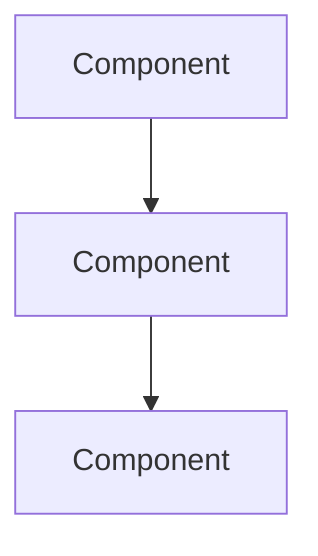

# ADR-{{number}}: {{title}}

## 🎯 Status
**{{status}}** - {{date}}

---

## 📋 Context and Problem Statement

### Context
> *What is the background? Why are we looking at this?*

### Problem
> *What specific problem are we trying to solve?*

### Requirements
- Functional:
  -
- Non-functional:
  -
- Constraints:
  -

---

## 🤔 Decision Drivers

Priority order (1 = highest):

1. **Driver**:
2. **Driver**:
3. **Driver**:
4. **Driver**:

---

## ✅ Considered Options

### Option 1: {{name}}
**Description**:

**Pros**:
- ✅
- ✅
- ✅

**Cons**:
- ❌
- ❌

**Cost/Effort**: Low / Medium / High

**Risk**: Low / Medium / High

### Option 2: {{name}}
**Description**:

**Pros**:
- ✅
- ✅

**Cons**:
- ❌
- ❌

**Cost/Effort**: Low / Medium / High

**Risk**: Low / Medium / High

### Option 3: {{name}}
**Description**:

**Pros**:
- ✅
- ✅

**Cons**:
- ❌
- ❌

**Cost/Effort**: Low / Medium / High

**Risk**: Low / Medium / High

---

## 🏆 Decision Outcome

### Chosen Option
**Option {{number}}: {{name}}**

### Rationale
> *Why this option best addresses our decision drivers*

### Implementation Overview
```
High-level implementation approach
```

---

## 🔍 Detailed Design

### Architecture Diagram


### Key Components
1. **Component Name**
   - Purpose:
   - Technology:
   - Location: `/Development/.../`

2. **Component Name**
   - Purpose:
   - Technology:
   - Location: `/Development/.../`

### Data Flow
1.
2.
3.

### API/Interface Design
```typescript
// Key interfaces or API contracts
interface Example {
  //...
}
```

---

## 📊 Consequences

### Positive
- ✅ **Immediate**:
- ✅ **Long-term**:
- ✅ **Team/Process**:

### Negative
- ⚠️ **Trade-offs**:
- ⚠️ **Technical Debt**:
- ⚠️ **Risks**:

### Neutral
- ➡️ **Changes Required**:
- ➡️ **Migration Path**:

---

## 📈 Success Metrics

How we'll know this decision was correct:

| Metric | Target | How to Measure |
|--------|--------|----------------|
| | | |
| | | |

---

## 🔄 Migration/Implementation Plan

### Phase 1: {{name}} (Timeline)
- [ ] Task
- [ ] Task

### Phase 2: {{name}} (Timeline)
- [ ] Task
- [ ] Task

### Rollback Plan
> *How do we reverse this decision if needed?*

---

## 💰 Cost Analysis

### Development Cost
- **Time Estimate**:
- **Team Size**:
- **Resources Needed**:

### Operational Cost
- **Infrastructure**:
- **Licensing**:
- **Maintenance**:

### Opportunity Cost
> *What are we NOT doing because of this decision?*

---

## 🔗 Related Decisions

### Depends On
- [[ADR-X-Title]]

### Influences
- [[ADR-Y-Title]]

### Supersedes
- [[ADR-Z-Title]]

---

## 📚 References

### Internal
- [[Project Documentation]]
- Code: `file:///home/obsidan/Development/.../`
- Previous discussions: [[Meeting-Note]]

### External
- [Technology Documentation]()
- [Blog Post/Article]()
- [Research Paper]()

---

## 🤝 Stakeholders

| Name | Role | Stance | Notes |
|------|------|--------|-------|
| | Tech Lead | Agrees/Disagrees | |
| | Product | Agrees/Disagrees | |
| | DevOps | Agrees/Disagrees | |

---

## 📝 Notes

### Open Questions
- [ ]

### Assumptions
-

### Out of Scope
-

---

## 📅 Decision History

| Date | Status | Change | By |
|------|--------|--------|-----|
| {{date}} | Proposed | Initial draft | |
| | Accepted | Approved with modifications | |
| | Implemented | Deployed to production | |

---

*Last Updated: {{date}}*
*Author:*
*Reviewers:*

[[ADR-Index]] | [[Architecture-Overview]] | [[Project-Hub]]