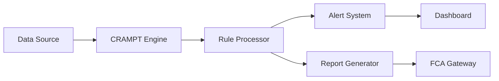

# 🛡️ CRAMPT Compliance Work: {{title}}

## 📋 Compliance Overview

| Field | Value |
|-------|-------|
| **Regulation** | FCA / MiFID II / IFPR / GDPR / AML |
| **Entity** | Orion Ridge Capital / One Global Market |
| **Rule Reference** | |
| **Effective Date** | |
| **Status** | 🔵 Research / 🟡 Implementing / 🟠 Testing / 🟢 Approved |
| **Risk Level** | Critical / High / Medium / Low |

---

## 📜 Regulatory Requirement

### Official Text
> *Quote from regulation*

### Our Interpretation
> *What this means for us*

### FCA Guidance
- Reference: [[FCA-Handbook#]]
- Key points:
  -
  -

### Impact Assessment
- **Operations**:
- **Technology**:
- **Reporting**:
- **Cost**:

---

## 🎯 Implementation Requirements

### Functional Requirements
1. **Monitor**:
   - What:
   - Frequency:
   - Thresholds:

2. **Report**:
   - Format:
   - Frequency:
   - Recipients:

3. **Alert**:
   - Conditions:
   - Escalation:
   - SLA:

### Data Requirements
- **Sources**:
  - System:
  - Fields:
  - Quality:

- **Storage**:
  - Retention:
  - Encryption:
  - Access:

### Audit Requirements
- **Trail**:
- **Evidence**:
- **Reviews**:

---

## 🏗️ CRAMPT Implementation

### Architecture


### Compliance Rules
```yaml
rule_id: {{ID}}
name: {{name}}
regulation: {{FCA/MIFID/IFPR}}
trigger:
  condition:
  threshold:
  frequency:
action:
  alert:
  report:
  escalate:
```

### Monitoring Logic
```typescript
interface ComplianceCheck {
  ruleId: string;
  entity: 'ORC' | 'OGM';
  check: () => boolean;
  onBreach: () => void;
  onPass: () => void;
}
```

---

## 📊 Risk Assessment

### Risk Matrix
| Risk | Likelihood | Impact | Score | Mitigation |
|------|------------|--------|-------|------------|
| Non-compliance | L/M/H | L/M/H | | |
| False positives | L/M/H | L/M/H | | |
| System failure | L/M/H | L/M/H | | |

### Control Measures
1. **Primary Control**:
   - Type:
   - Implementation:
   - Testing:

2. **Secondary Control**:
   - Type:
   - Implementation:
   - Testing:

3. **Compensating Control**:
   - Type:
   - Implementation:
   - Testing:

---

## 🧪 Testing Plan

### Test Scenarios

#### Scenario 1: Normal Operation
- **Input**:
- **Expected**:
- **Pass Criteria**:

#### Scenario 2: Breach Detection
- **Input**:
- **Expected**:
- **Pass Criteria**:

#### Scenario 3: Edge Case
- **Input**:
- **Expected**:
- **Pass Criteria**:

### UAT Requirements
- [ ] Compliance team review
- [ ] Legal sign-off
- [ ] Operations walkthrough
- [ ] Incident simulation

---

## 📈 Reporting Configuration

### Regular Reports
1. **Daily Report**
   - Content:
   - Recipients:
   - Time:

2. **Monthly Report**
   - Content:
   - Recipients:
   - Time:

3. **Quarterly Report**
   - Content:
   - Recipients:
   - Time:

### Ad-hoc Reports
- Trigger events:
- Format:
- Distribution:

### FCA Submissions
- **SUP Report**:
- **Frequency**:
- **Format**: XBRL / CSV / PDF
- **Deadline**:

---

## 🚨 Alert Configuration

### Alert Levels
1. **🔴 Critical**
   - Condition:
   - Recipients:
   - SLA: Immediate

2. **🟡 Warning**
   - Condition:
   - Recipients:
   - SLA: 1 hour

3. **🔵 Info**
   - Condition:
   - Recipients:
   - SLA: Daily digest

### Escalation Path
```
Level 1: Compliance Officer → 15 mins
Level 2: Head of Compliance → 30 mins
Level 3: CEO/Board → 1 hour
```

---

## 📝 Documentation

### Policies Updated
- [ ] [[Compliance-Policy]]
- [ ] [[Risk-Management-Policy]]
- [ ] [[Monitoring-Procedures]]

### Training Materials
- [ ] Staff guide created
- [ ] Training scheduled
- [ ] Competency testing

### External Communications
- [ ] FCA notification (if required)
- [ ] Client disclosure (if required)
- [ ] Website updates

---

## ✅ Implementation Checklist

### Pre-Implementation
- [ ] Regulation reviewed
- [ ] Impact assessed
- [ ] Solution designed
- [ ] Risk assessment complete
- [ ] Legal review

### Implementation
- [ ] Rules configured
- [ ] Monitoring active
- [ ] Reports scheduled
- [ ] Alerts configured
- [ ] Testing complete

### Post-Implementation
- [ ] Go-live verification
- [ ] Team trained
- [ ] Documentation updated
- [ ] FCA notified (if required)
- [ ] Effectiveness review scheduled

---

## 🔗 References

### Internal
- [[CRAMPT-Hub]]
- [[Compliance-Matrix]]
- [[ORC-Compliance]] / [[OGM-Compliance]]
- Related: [[Previous-Similar-Implementation]]

### Regulatory
- [FCA Handbook](https://www.handbook.fca.org.uk/)
- [ESMA Guidelines]()
- [Industry Guidance]()

### Implementation
- Code: `file:///home/obsidan/Development/CRAMPT/src/rules/`
- Config: `file:///home/obsidan/Development/CRAMPT/config/`
- Tests: `file:///home/obsidan/Development/CRAMPT/tests/`

---

## 📅 Timeline

| Date | Milestone | Status |
|------|-----------|---------|
| {{date}} | Requirement identified | ✅ |
| | Solution designed | |
| | Implementation complete | |
| | Testing complete | |
| | Go-live | |
| | Post-implementation review | |

---

## 👥 Stakeholders

| Name | Role | Responsibility | Sign-off |
|------|------|----------------|----------|
| | Compliance | Requirement owner | ☐ |
| | Legal | Regulatory interpretation | ☐ |
| | Technology | Implementation | ☐ |
| | Operations | Business process | ☐ |
| | Risk | Risk assessment | ☐ |

---

*Last Updated: {{date}}*
*Compliance Owner:*
*Tech Lead:*

[[CRAMPT-Hub]] | [[Compliance-Matrix]] | [[Home]]