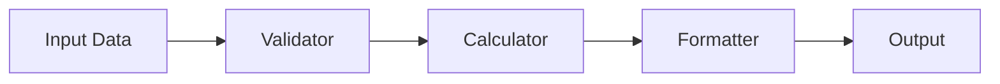

# K-Factor Work: {{K-Factor Name}}

## 📊 K-Factor Overview

| Field | Value |
|-------|-------|
| **K-Factor Code** | K- |
| **Category** | RtC / RtM / RtF |
| **Formula** | |
| **FCA Reference** | IFPR . |
| **Status** | 🔵 Research / 🟡 Implementing / 🟠 Testing / 🟢 Complete |

---

## 📋 Requirements

### Regulatory Requirements
> *From FCA IFPR Handbook*

- Calculation frequency:
- Reporting requirements:
- Precision requirements:
- Special conditions:

### Business Requirements
- Input sources:
- Output format:
- Integration points:
- Performance targets:

---

## 🔬 Research & Analysis

### FCA Guidance Review
- **Document**: [[FCA-IFPR-Handbook#]]
- **Key Points**:
  -
  -

### Similar Implementations
- K-Factor: [[]]
- Reusable components:
- Patterns to follow:

### Edge Cases
1. **Case**:
   - Scenario:
   - Handling:

2. **Case**:
   - Scenario:
   - Handling:

---

## 🏗️ Implementation Design

### Architecture


### Data Model
```typescript
interface K_Input {
  // Input fields
}

interface K_Output {
  value: Decimal;
  currency: string;
  calculationDate: Date;
  metadata: {
    // ...
  };
}
```

### Calculation Logic
```typescript
// Pseudocode or actual implementation
function calculateK_(input: K_Input): K_Output {
  // Step 1:
  // Step 2:
  // Step 3:
  return result;
}
```

### Files Structure
```
/PRISM-PRODUCTION/src/calculators/
├── k_.ts           # Main calculator
├── k_.validator.ts # Input validation
├── k_.formatter.ts # Output formatting
└── k_.types.ts     # Type definitions
```

---

## 💻 Implementation Progress

### Development Tasks
- [ ] Create type definitions
- [ ] Implement validator
- [ ] Core calculation logic
- [ ] Output formatter
- [ ] Error handling
- [ ] Logging
- [ ] Performance optimization

### Code Location
- **Main Implementation**: `/Development/PRISM-PRODUCTION/src/calculators/k_.ts`
- **Tests**: `/Development/PRISM-PRODUCTION/tests/calculators/k_.test.ts`
- **Branch**: `feature/k-factor-`

### Key Decisions
1. **Decision**:
   - Reasoning:
   - Impact:

2. **Decision**:
   - Reasoning:
   - Impact:

---

## 🧪 Testing Strategy

### Test Coverage Goals
- Unit tests: 95%
- Integration tests: 85%
- Edge cases: 100%

### Test Scenarios

#### Scenario 1: Normal Operation
```typescript
// Input
const input = {
  // ...
};
// Expected output
const expected = {
  value: 12345.67,
  // ...
};
```

#### Scenario 2: Edge Case
```typescript
// Description of edge case
```

#### Scenario 3: Error Handling
```typescript
// Invalid input handling
```

### Test Data
- **Location**: `/srv/prism-shared/GOLDEN-SOURCE/01-PROTOTYPES/test data generators/`
- **Generator**: `k_test_generator.ts`
- **Sample Size**: records

---

## 🔍 Validation Rules

### Input Validation
- [ ] Required fields present
- [ ] Data types correct
- [ ] Values within ranges
- [ ] Date ranges valid
- [ ] Currency consistency

### Business Rules
- [ ] Rule 1:
- [ ] Rule 2:
- [ ] Rule 3:

### Output Validation
- [ ] Precision (4 decimal places)
- [ ] Non-negative values
- [ ] Currency format
- [ ] Metadata complete

---

## 📈 Performance Metrics

| Metric | Target | Actual |
|--------|--------|--------|
| Calculation time (avg) | <50ms | ms |
| Memory usage | <100MB | MB |
| Records per second | >1000 | |
| Batch size limit | 10000 | |

---

## 🐛 Issues & Resolutions

### Issue 1:
- **Description**:
- **Resolution**:
- **Prevention**:

### Issue 2:
- **Description**:
- **Resolution**:
- **Prevention**:

---

## 📝 Documentation

### API Documentation
```yaml
endpoint: /api/v1/k-factors/k-
method: POST
request:
  # Schema
response:
  # Schema
```

### Usage Example
```typescript
import { calculateK } from './calculators/k_';

const result = await calculateK({
  // input
});
```

### Integration Guide
- How to integrate:
- Dependencies:
- Configuration:

---

## ✅ Acceptance Criteria

### Functional
- [ ] Calculates correctly per FCA formula
- [ ] Handles all edge cases
- [ ] Proper error messages
- [ ] Audit trail complete

### Non-Functional
- [ ] Performance targets met
- [ ] Test coverage achieved
- [ ] Documentation complete
- [ ] Code review passed

### Regulatory
- [ ] FCA compliance verified
- [ ] Precision requirements met
- [ ] Reporting format correct
- [ ] Historical data handling

---

## 🔗 References

### Internal
- [[K-Factor-Index]]
- [[PRISM-Hub]]
- [[Module-3-Overview]]
- Similar: [[K-AUM-Implementation]]

### External
- [FCA IFPR Sourcebook](https://www.handbook.fca.org.uk/handbook/IFPR/)
- [K-Factor Calculation Guide]()

### Code
- Implementation: `file:///home/obsidan/Development/PRISM-PRODUCTION/src/calculators/`
- Tests: `file:///home/obsidan/Development/PRISM-PRODUCTION/tests/calculators/`
- PR: [#]()

---

## 📊 Progress Tracking

### Milestones
- [x] Research complete - {{date}}
- [ ] Design approved -
- [ ] Implementation complete -
- [ ] Testing complete -
- [ ] Code review -
- [ ] Deployed to staging -
- [ ] Production release -

---

*Last Updated: {{date}}*
*Assignee:*

[[K-Factor-Index]] | [[PRISM-Hub]] | [[Module-3-Overview]]