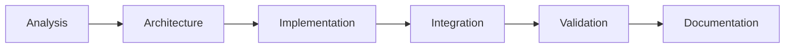
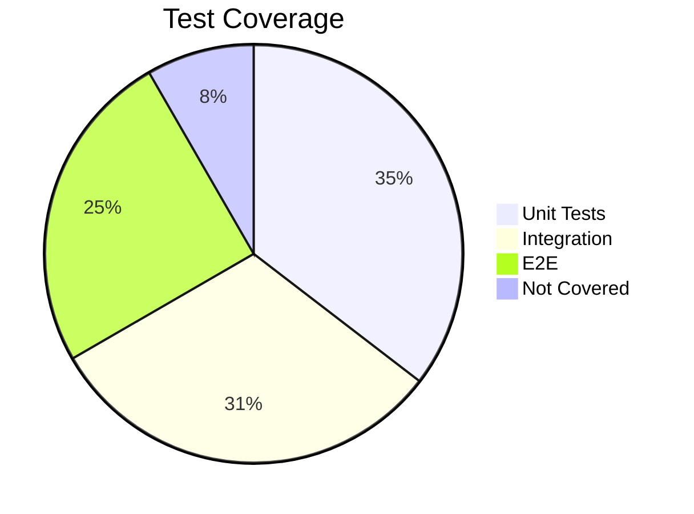

```mermaid
gantt
    title Session Progress
    dateFormat HH:mm
    section Tasks
    Analysis           :done, 09:00, 1h
    Implementation     :done, 10:00, 3h
    Testing           :active, 13:00, 2h
    Documentation     :15:00, 1h
```

<!--
═══════════════════════════════════════════════════════════════════════
📝 SESSION WRAP TEMPLATE - COMPLETION INSTRUCTIONS
═══════════════════════════════════════════════════════════════════════

HOW TO COMPLETE THIS TEMPLATE:

1. FILE NAMING CONVENTION (CRITICAL):
   Save as: session_wrap_[MODULE/FEATURE]_[YYYYMMDD].md
   Examples:
   - session_wrap_KFR-asa-mod_20112025.md
   - session_wrap_CRAMPT-rules-engine_20112025.md
   - session_wrap_k-factor-cmg_20112025.md

2. FRONTMATTER FIELDS (Update these first):
   - date: Today's date in YYYY-MM-DD format
   - project: PRISM, CRAMPT, TMS, etc.
   - module: Specific module/feature worked on
   - status: completed, partial, or blocked
   - duration: Session length in hours
   - lines_of_code: Total lines written/modified (estimate OK)
   - tags: Add relevant tags for searching

3. COMPLETION CHECKLIST:
   □ Update frontmatter with actual values
   □ Fill in session metrics table
   □ Document objectives & achievement rate
   □ List all files created/modified with line counts
   □ Capture key decisions with rationale
   □ Document issues & resolutions
   □ Record performance metrics
   □ Note integration impacts
   □ Define next steps clearly
   □ Add retrospective insights

4. KEY SECTIONS TO COMPLETE:
   - Lines of Code: Be specific (e.g., "~1,250 lines")
   - Objectives: Mark completed with [x], incomplete with [ ]
   - Decisions: Link to ADRs if created
   - Issues: Include resolution and prevention
   - Performance: Actual metrics vs targets
   - Next Steps: Assignee and timeline

5. USING TEMPLATE VARIABLES:
   - Replace all {{variable}} with actual values
   - Delete unused sections if not applicable
   - Keep all regulatory compliance items for audit

6. OBSIDIAN FEATURES TO USE:
   - [[Wiki Links]] for cross-references
   - `file:///path` for external code files
   - Callouts (SUCCESS, WARNING, IMPORTANT, TIP)
   - Mermaid diagrams for architecture/flow
   - Tables for structured data
   - Task checkboxes for action items

7. POST-COMPLETION:
   - Move to: /02-Projects/[PROJECT]/Session-Wraps/
   - Update: [[Session-Index]] with new entry
   - Link from: Daily note and project hub
   - Tag appropriately for search

REMEMBER: This document serves as official project documentation
and may be used for regulatory audits. Be thorough and accurate!
═══════════════════════════════════════════════════════════════════════
-->

# 📋 Session Wrap: [[{{module}}]]

| Field                     | Value                                    |
| ------------------------- | ---------------------------------------- |
| **Date**                  | {{date:YYYY-MM-DD}}                      |
| **Session Duration**      | {{time}} - {{time}} ({{duration}} hours) |
| **Lines of Code Written** | {{lines_of_code}} lines                  |
| **Session Lead**          | {{author}}                               |
| **Claude Code Version**   | {{version}}                              |
| **Module Category**       | Core / Supplementary                     |
| **Module Status**         | 🔴 Pre → 🟢 Post                         |

---

## 1️⃣ CONTEXT & STRATEGY VERIFICATION

### ✅ Context Files Referenced
```dataview
TABLE status as "Status"
FROM "PRISM/GOLDEN-SOURCE/02-DOCUMENTATION/context"
WHERE file.name != this.file.name
LIMIT 10
```

### 📋 Compliance Checklist
- [ ] **Regulatory**: MiFIDPRU/ICARA requirements ✓
- [ ] **Architecture**: Next.js/TypeScript patterns ✓
- [ ] **Integration**: Cross-module compatibility ✓
- [ ] **Performance**: <200ms response time ✓
- [ ] **Security**: SMCR-aligned access control ✓
- [ ] **Audit Trail**: 7-year compliance logging ✓

### 🎯 Session Objectives
> [!NOTE]
> Objective Achievement: {{completed}}/{{total}} (**{{percentage}}%**)

1. - [x] Primary: {{objective1}}
2. - [ ] Secondary: {{objective2}}
3. - [ ] Additional: {{objective3}}

---

## 2️⃣ EXECUTION PLAN

### 📊 File Operations Matrix



### 🗂️ Module Structure
![[Module-File-Structure#{{module}}]]

| Component | Planned | Actual | Status | Link |
|-----------|---------|---------|---------|------|
| Calculator | Create | ✅ Created | 🟢 | [[{{module}}-Calculator]] |
| Form | Create | ✅ Created | 🟢 | `file:///Development/.../Form.tsx` |
| API | Create | ⚠️ Partial | 🟡 | `file:///Development/.../api.ts` |
| Tests | Create | ❌ Pending | 🔴 | [[Testing-Backlog#{{module}}]] |

---

## 3️⃣ EXECUTION SUMMARY

### 🚀 Completed Operations

> [!SUCCESS]
> **Phase 1: Analysis & Planning**
> - HTML Prototype: `{{source_file}}`
> - Business Logic: [[{{module}}-Business-Logic]]
> - Regulatory: [[FCA-Compliance#{{regulation}}]]
> - Performance Baseline: {{metric}}ms

### 💻 Implementation Details

#### TypeScript Interfaces
```typescript
// Key interfaces created
interface {{Module}}Input {
  // Captured in: [[{{module}}-Types]]
}

interface {{Module}}Output {
  // See: file:///Development/PRISM/.../types.ts
}
```

#### React Components
- **Main Calculator**: [[{{module}}-Calculator-Docs]]
- **Form Components**: [[{{module}}-Form-Docs]]
- **Results Display**: [[{{module}}-Results-Docs]]

### ⚠️ Issues & Resolutions

> [!WARNING]
> **Issue 1: {{issue_title}}**
> - **Impact**: High/Medium/Low
> - **Resolution**: {{resolution}}
> - **Prevention**: [[Issue-Prevention-Guide#{{issue_type}}]]
> - **Tracked**: [[Bug-Tracker#{{bug_id}}]]

### 🧠 Key Decisions

> [!IMPORTANT]
> **Decision: {{decision_title}}**
> - **Rationale**: {{why}}
> - **Alternatives**: {{alternatives}}
> - **ADR**: [[ADR-{{number}}-{{decision}}]]
> - **Impact**: [[Architecture-Impact#{{decision}}]]

### 📈 Performance Metrics

```dataview
TABLE metric, target, actual, status
FROM "Session-Metrics"
WHERE session = this.file.name
```

| Metric | Target | Actual | Status |
|--------|--------|--------|--------|
| Calculation Time | <200ms | {{actual}}ms | {{status}} |
| Render Time | <50ms | {{actual}}ms | {{status}} |
| API Response | <100ms | {{actual}}ms | {{status}} |
| Memory Usage | <50MB | {{actual}}MB | {{status}} |

---

## 4️⃣ TESTING OUTCOMES

### 🧪 Test Coverage Dashboard



### 📊 Cross-Validation Results

| Scenario | HTML Result | React Result | Deviation | Status |
|----------|-------------|--------------|-----------|--------|
| Basic | £{{html}} | £{{react}} | £{{diff}} | {{status}} |
| Complex | £{{html}} | £{{react}} | £{{diff}} | {{status}} |
| Edge Case | £{{html}} | £{{react}} | £{{diff}} | {{status}} |

### 🔍 Outstanding Issues
- [ ] Critical: [[Critical-Issues#{{issue1}}]]
- [ ] High: [[High-Priority#{{issue2}}]]
- [ ] Medium: [[Medium-Priority#{{issue3}}]]

---

## 5️⃣ INTEGRATION IMPACT

### 🔗 Dependency Graph

```mermaid
graph TD
    A[{{module}}] --> B[Module 1]
    A --> C[Module 2]
    D[Module 3] --> A
    E[Dashboard] --> A
```

### 📊 System Impact Matrix

| Component | Impact | Breaking Changes | Migration |
|-----------|--------|------------------|-----------|
| MCR Calculation | {{impact}} | No | N/A |
| Dashboard | {{impact}} | Yes | [[Migration-Guide#{{module}}]] |
| Reporting | {{impact}} | No | N/A |

---

## 6️⃣ QUALITY & COMPLIANCE

### 📋 Quality Metrics
- **TypeScript**: {{percentage}}% strict compliance
- **Test Coverage**: {{percentage}}% overall
- **Security Scan**: {{vulns}} vulnerabilities
- **Code Review**: [[Code-Review#{{session}}]]

### 🔐 Compliance Validation
- [ ] SMCR Access Control ✓
- [ ] AES-256 Encryption ✓
- [ ] Audit Trail Complete ✓
- [ ] FCA-Ready Format ✓

---

## 7️⃣ NEXT STEPS

### 🎯 Immediate Actions (24-48h)

```dataview
TASK
FROM "Session-Actions"
WHERE session = this.file.name AND priority = "immediate"
```

1. - [ ] **Priority 1**: {{action1}} @[[{{owner}}]] 📅 {{date}}
2. - [ ] **Priority 2**: {{action2}} @[[{{owner}}]] 📅 {{date}}
3. - [ ] **Priority 3**: {{action3}} @[[{{owner}}]] 📅 {{date}}

### 🔄 Required Testing
- [ ] Module Integration: [[Test-Plan#{{module}}-integration]]
- [ ] System Integration: [[Test-Plan#e2e]]
- [ ] Performance: [[Performance-Test#{{module}}]]
- [ ] UAT: [[UAT-Scenarios#{{module}}]]

---

## 8️⃣ RETROSPECTIVE

### 👍 What Went Well
1. {{success1}} - [[Best-Practices#{{topic}}]]
2. {{success2}}
3. {{success3}}

### 🔧 Improvements Needed
1. {{improvement1}} → [[Process-Improvements#{{id}}]]
2. {{improvement2}} → [[Process-Improvements#{{id}}]]

### 📚 Lessons Learned
> [!TIP]
> Key lessons captured for future sessions:
> 1. {{lesson1}} - Added to: [[Lessons-Learned-Log]]
> 2. {{lesson2}} - Added to: [[Lessons-Learned-Log]]

---

## 9️⃣ RISK REGISTER

### ⚠️ Active Risks

```dataview
TABLE probability, impact, mitigation, owner
FROM "Risk-Register"
WHERE project = "PRISM" AND status = "active"
SORT impact DESC
```

| Risk | Probability | Impact | Mitigation |
|------|-------------|--------|------------|
| {{risk1}} | H/M/L | H/M/L | [[Risk-Mitigation#{{risk1}}]] |
| {{risk2}} | H/M/L | H/M/L | [[Risk-Mitigation#{{risk2}}]] |

---

## 🔟 STAKEHOLDER UPDATES

### 📢 Executive Summary
> [!ABSTRACT]
> **Progress**: {{percentage}}% complete
> **Status**: On Track / At Risk / Delayed
> **Key Achievement**: {{achievement}}
> **Next Milestone**: {{milestone}}

### 📊 Dashboard Metrics
- **Completion**: {{before}}% → {{after}}%
- **Quality Score**: {{score}}/100
- **Risk Level**: 🟢 Low / 🟡 Medium / 🔴 High
- **Next Review**: [[{{next_session}}]]

---

## 📎 APPENDICES

### 📁 File Links
- [[Session-Files/{{date}}-File-Inventory]]
- [[Test-Results/{{date}}-Test-Output]]
- [[Quality-Reports/{{date}}-Code-Quality]]
- [[Compliance/{{date}}-Regulatory-Evidence]]

### 🔗 Quick References
- **Code Location**: `file:///Development/PRISM-PRODUCTION/{{module}}/`
- **Branch**: `feature/{{module}}-{{date}}`
- **PR**: [#{{pr_number}}]({{pr_link}})
- **Commit**: `{{commit_hash}}`

### 📅 Session Timeline


---

## 🏷️ Tags & Links

**Tags**: #session-wrap #prism #{{module}} #{{date:YYYY-MM}}

**Related Sessions**:
← [[Previous-Session-{{date}}]] | [[Session-Index]] | [[Next-Session-{{date}}]] →

**Project Links**:
[[PRISM-Hub]] | [[Module-Overview]] | [[K-Factor-Index]] | [[Testing-Dashboard]]

---

*Session Completed: {{date:YYYY-MM-DD HH:mm}}*
*Prepared By: {{author}}*
*Review Status: ⏳ Pending / ✅ Reviewed*
*Next Session: [[Session-{{next_date}}]]*

---

> [!NOTE]
> This session wrap serves as official documentation for regulatory audit and project management purposes. All information is accurate as of session completion.

<!--
Obsidian Features Used:
- Dataview queries for dynamic content
- Mermaid diagrams for visualization
- Callouts for emphasis
- Wiki-links for navigation
- Tags for categorization
- File URIs for external links
- Templates variables for quick fill
-->