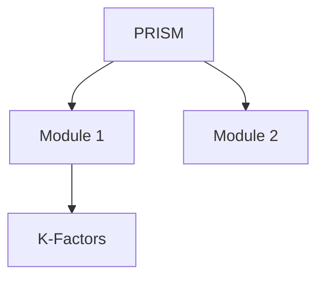

# 🎯 Obsidian Power Features Guide

> *From basics to beast mode - master Obsidian like a pro*

---

## 🌐 1. GRAPH VIEW - Your Knowledge Visualised

### Access: `Ctrl+G` or click graph icon

### What it Shows:
- **Nodes** = Your notes
- **Lines** = Links between notes
- **Clusters** = Related topics
- **Orphans** = Unlinked notes

### Power Moves:
```
🔥 Try This Now:
1. Open Graph View (Ctrl+G)
2. Filter: path:PRISM
3. Watch your PRISM universe visualize!
```

### Graph Filters:
- `path:PRISM` - Only PRISM files
- `tag:#urgent` - Only urgent items
- `-path:Archive` - Exclude archives
- `file:K-Factor` - Files with "K-Factor" in name

### Graph Controls:
- **Drag nodes** - Reorganize manually
- **Scroll** - Zoom in/out
- **Click node** - Open that note
- **Hover** - See connections

---

## 🔍 2. SEARCH OPERATORS - Find Anything Instantly

### Basic Search: `Ctrl+Shift+F`

### Power Operators:

| Operator   | Example                      | What it Finds            |
| ---------- | ---------------------------- | ------------------------ |
| `path:`    | `path:PRISM/GOLDEN`          | Files in specific folder |
| `file:`    | `file:calculator`            | Filename contains word   |
| `content:` | `content:"K-Factor"`         | Exact phrase in content  |
| `tag:`     | `tag:#prism/compliance`      | Specific tags            |
| `line:`    | `line:(TODO OR FIXME)`       | Lines with either word   |
| `section:` | `section:"Implementation"`   | Heading sections         |
| `block:`   | `block:(function calculate)` | Code blocks              |
| `/regex/`  | `/K-[A-Z]{3}/`               | Regex patterns           |

### Combining Operators:
```
path:PRISM tag:#urgent -file:test
```
(PRISM files tagged urgent, excluding test files)

### Date Searches:
- `created:today` - Created today
- `modified:week-1` - Modified last week
- `created:2024-11..2024-12` - Created in date range

---

## 🔗 3. ADVANCED LINKING - Beyond Basic [[Links]]

### Link Types:

#### Heading Links:
```markdown
[[PRISM-Hub#Module Overview]]
```

#### Block References:
```markdown
[[PRISM-Hub^important-block]]
```
(First mark block with ^important-block)

#### Aliases:
```markdown
[[PRISM_MASTER_REFERENCE|Master Ref]]
```

#### Embeds (Transclusion):
```markdown
![[PRISM-Hub#Current Sprint Focus]]
```
(Shows content inline without opening)

---

## 📊 4. DATAVIEW - Turn Notes into Databases

### Enable: Community Plugins → Dataview

### Basic Queries:

#### List all urgent tasks:
```dataview
TASK
WHERE contains(tags, "#urgent")
WHERE !completed
```

#### Table of recent PRISM work:
```dataview
TABLE file.mtime as "Modified", tags as "Tags"
FROM "02-Projects/PRISM"
SORT file.mtime DESC
LIMIT 10
```

#### Project status dashboard:
```dataview
TABLE status, priority, file.mtime as "Last Updated"
FROM "02-Projects"
WHERE status != "completed"
SORT priority DESC
```

---

## 🎨 5. WORKSPACES - Custom Layouts

### Save Current Layout:
1. Arrange panes how you like
2. Left sidebar → Manage workspace layouts (grid icon)
3. Save workspace
4. Name it (e.g., "PRISM Development")

### Suggested Workspaces:

#### "Daily Review"
- Left: File explorer
- Center: Daily note
- Right top: Today's tasks
- Right bottom: Calendar

#### "PRISM Development"
- Left: PRISM folder tree
- Center: Current file
- Right: PRISM-Hub pinned
- Bottom: Terminal (with plugin)

---

## ⚡ 6. QUICK SWITCHER MAGIC

### Beyond Basic: `Ctrl+O`

#### Smart Patterns:
- Type `#` first → Shows all tags
- Type `^` → Recent files
- Type `/` → Navigate by path
- Type `>` → Command palette

#### Fuzzy Finding:
- `prmh` → Finds "PRISM-Hub"
- `kfac` → Finds "K-Factor"

---

## 🏷️ 7. SMART TAGGING

### Nested Tags:
```markdown
#prism/module-1/complete
#prism/k-factor/implemented
```

### Tag Pane Features:
- Right-click → Rename globally
- Drag & drop → Reorganize hierarchy
- Click → See all tagged notes

---

## ✍️ 8. TEMPLATES WITH TEMPLATER

### Install: Community Plugins → Templater

### Power Templates:

#### Dynamic Daily Note:
```markdown
## 📅 <% tp.date.now("dddd, MMMM Do") %>

### 🎯 Top 3 Priorities
1. <% tp.system.prompt("Priority 1?") %>
2. <% tp.system.prompt("Priority 2?") %>
3. <% tp.system.prompt("Priority 3?") %>

### 📊 Active Projects
<% tp.web.daily_quote() %>
```

#### Smart Meeting Note:
```markdown
# Meeting: <% tp.system.prompt("Meeting Title") %>
Date: <% tp.date.now() %>
Attendees: <% tp.system.prompt("Who attended?") %>

## Action Items
<% tp.file.cursor() %>
```

---

## 🔄 9. HOTKEYS TO CUSTOMIZE

### Go to Settings → Hotkeys

#### Suggested Custom Hotkeys:
- `Alt+T` → Insert template
- `Alt+D` → Open daily note
- `Alt+G` → Toggle graph view
- `Alt+/` → Toggle file explorer
- `Alt+L` → Toggle backlinks pane

---

## 🧩 10. ESSENTIAL PLUGINS

### Must-Have:
1. **Calendar** - Visual daily notes
2. **Dataview** - Database queries
3. **Templater** - Advanced templates
4. **Outliner** - Better list management
5. **Quick Switcher++** - Enhanced navigation

### For Developers:
1. **Execute Code** - Run code blocks
2. **Git** - Version control
3. **Vim Mode** - Vim keybindings
4. **Code Block Copy** - Copy button for code
5. **Terminal** - Integrated terminal

### For Project Management:
1. **Kanban** - Kanban boards
2. **Tasks** - Advanced task management
3. **Projects** - Project tracking
4. **Gantt** - Timeline views
5. **Charts** - Data visualization

---

## 🎮 11. COMMAND PALETTE TRICKS

### Access: `Ctrl+P`

#### Power Commands:
- "Split" → Split panes
- "Toggle fold" → Collapse/expand
- "Export" → PDF/HTML export
- "Replace" → Find & replace
- "Bookmarks" → Manage bookmarks

---

## 📝 12. MARKDOWN POWER-UPS

### Callouts:
```markdown
> [!NOTE]
> Important information

> [!WARNING]
> Critical warning

> [!TIP]
> Helpful tip

> [!IMPORTANT]
> Don't miss this
```

### Mermaid Diagrams:
````markdown

````

### Math (LaTeX):
```markdown
$$
K_{AUM} = 0.02\% \times AUM_{total}
$$
```

---

## 🚀 13. QUICK CAPTURE

### Global Hotkey:
1. Settings → Hotkeys → "Quick Note"
2. Set system-wide hotkey (e.g., `Ctrl+Shift+O`)
3. Capture from anywhere!

---

## 💡 14. ADVANCED SEARCH & REPLACE

### Regex in Search:
- Settings → Enable "Use regular expressions"
- Example: `/K-[A-Z]{3}/` finds all K-Factor codes

### Batch Operations:
- Search: `path:PRISM content:"TODO"`
- Use search results pane
- Right-click → Copy search results

---

## 🎯 15. FOCUS MODE

### Distraction-Free Writing:
- `Ctrl+Shift+F11` - Toggle fullscreen
- Hide sidebars: Click collapse arrows
- Settings → Editor → "Focus mode" (highlights current line)

---

## 🔥 PRO WORKFLOW TIPS

### 1. Daily Note Workflow:
```
Morning: Create daily note → Review yesterday → Set priorities
During: Quick capture → Link to projects
Evening: Review → Move incomplete → Tomorrow's note
```

### 2. Meeting Workflow:
```
Before: Create from template → Add agenda
During: Live notes → Action items with [ ]
After: Distribute actions → Link to projects
```

### 3. Project Workflow:
```
Start: Project hub note → Link resources
Work: Update status → Log decisions
Review: Backlinks → Find connections
```

---

## ⚠️ POWER USER WARNINGS

1. **Don't over-plugin** - Start with 5-6 max
2. **Backup regularly** - Use Git or cloud sync
3. **Learn shortcuts gradually** - 2-3 per week
4. **Don't over-organise** - Let structure emerge
5. **Use daily notes** - They're your anchor

---

## 🎓 NEXT STEPS

1. **Today**: Try Graph View on PRISM
2. **This Week**: Install Calendar & Dataview
3. **This Month**: Master search operators
4. **Ongoing**: Develop your workflow

---

## 🆘 TROUBLESHOOTING

### Slow Performance?
- Limit graph view nodes
- Close unused panes
- Disable unused plugins

### Can't Find Something?
- Use Quick Switcher with fuzzy search
- Check Deleted Files (if enabled)
- Use global search with operators

### Links Not Working?
- Check file exists
- Verify path spelling
- Use [[]] picker for accuracy

---

*Power guide v1.0 - Keep this handy!*
[[Home]] | [[QUICK-START-GUIDE]]